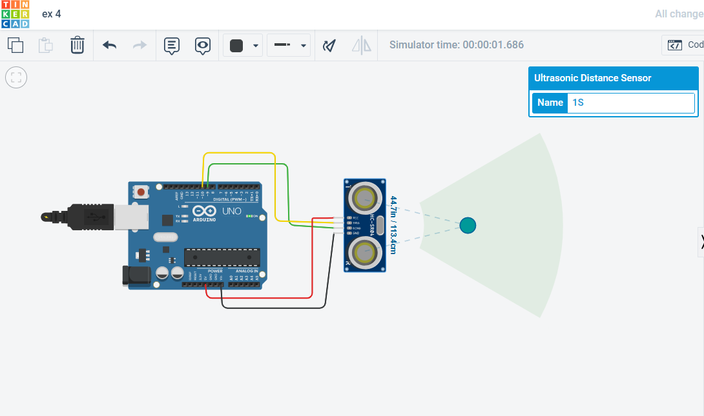

# EXPERIMENT-NO--05-Distance measurement using Ultrasonic sensor

## AIM: 
To interface an FSR(force sensitive resistor) and scale the output voltage obtained to pressure applied 
 
### COMPONENTS REQUIRED:
1.	ultrasonic sensor module HC-SR04
2.	1 KΩ resistor 
3.	Arduino Uno 
4.	USB Interfacing cable 
5.	Connecting wires 


### THEORY: 
The HC-SR04 ultrasonic sensor uses SONAR to determine the distance of an object just like the bats do. It offers excellent non-contact range detection with high accuracy and stable readings in an easy-to-use package from 2 cm to 400 cm or 1” to 13 feet.

The operation is not affected by sunlight or black material, although acoustically, soft materials like cloth can be difficult to detect. It comes complete with ultrasonic transmitter and receiver module.
Technical Specifications
Power Supply − +5V DC
Quiescent Current − <2mA
Working Current − 15mA
Effectual Angle − <15°
Ranging Distance − 2cm – 400 cm/1″ – 13ft
Resolution − 0.3 cm
Measuring Angle − 30 degree

The ultrasonic sensor uses sonar to determine the distance to an object. Here’s what happens:

The ultrasound transmitter (trig pin) emits a high-frequency sound (40 kHz).
The sound travels through the air. If it finds an object, it bounces back to the module.
The ultrasound receiver (echo pin) receives the reflected sound (echo).
The time between the transmission and reception of the signal allows us to calculate the distance to an object. This is possible because we know the sound’s velocity in the air. Here’s the formula:

distance to an object = ((speed of sound in the air)*time)/2
speed of sound in the air at 20ºC (68ºF) = 343m/s

### FIGURE 01 CIRCUIT OF INTERFACING ULTRASONIC SENSOR 


### PROCEDURE:
1.	Connect the circuit as per the circuit diagram 
2.	Connect the board to your computer via the USB cable.
3.	If needed, install the drivers.
4.	Launch the Arduino IDE.
5.	Select the board (If you the board is arduino uno, select accordingly).
6.	Select your serial port, accordingly ( E.g. COM5 )
7.	Open the file of the program  and verify the error , clear if any errors that are existing 
8.	Upload the program and check for the physical working. 
9.	Ensure safety before powering up the device 
10.	Plot the graph for the output voltage vs the resistance 


### PROGRAM 

### Distance vs measurement table 
```
#define echopin 9
#define trigpin 10
long duration;
int distance;

void setup()
{
  pinMode(trigpin, OUTPUT);
  pinMode(echopin, INPUT);
  Serial.begin(9600);
}

void loop()
{
  digitalWrite(trigpin, LOW);
  delayMicroseconds(2); // Wait for 1000 millisecond(s)
  digitalWrite(trigpin, HIGH);
  delayMicroseconds(10); // Wait for 1000 millisecond(s)
  digitalWrite(trigpin, LOW);
  duration = pulseIn(echopin, HIGH);
  distance = duration * 0.034/2;
  Serial.print("Distance: ");
  Serial.print(distance);
  Serial.println(" cm");
}
```
### OUTPUT

### RESULTS
Thus we have interfaced an FSR(force sensitive resistor) and scale the output voltage obtained to pressure applied 


 
